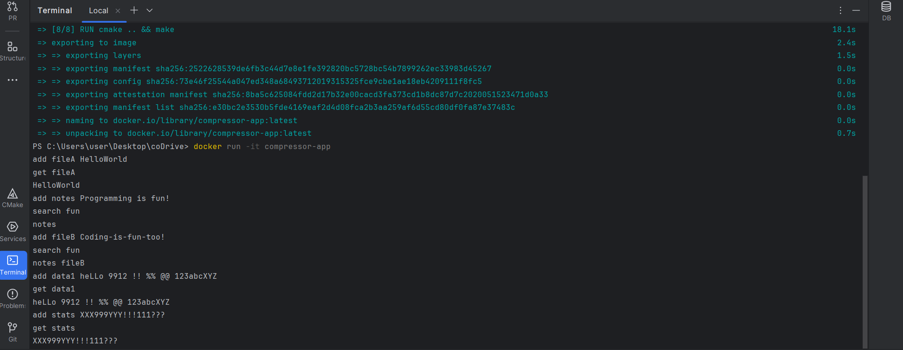

# coDrive Project


This project implements a **compressed article storage system** using a custom **RLE-based encoding** that supports *every ASCII character*, including digits, symbols, spaces, and backslashes.


The project includes:
- Full application logic (CLI-based)
- RLE compression/decompression
- File I/O with environment-based folder selection
- Command parsing (add / get / search)
- Comprehensive GoogleTest suite
- Docker integration for easy building & running
---
## Project Structure:
```
coDrive/
├── src/                          # Application Logic
│   ├── Application.h             # Main application class
│   ├── CommandParser.cpp         # CLI parsing (add, get, search)
│   ├── CommandParser.h
│   ├── ConcreteCommands.h        # add/get/search command classes
│   ├── FileManager.cpp           # File I/O + environment-based paths
│   ├── FileManager.h
│   ├── ICommand.h                # Base command interface
│   ├── main.cpp                  # Program entry point
│   ├── RLECompressor.cpp         # Escape-safe RLE compression
│   ├── RLECompressor.h
│   ├── RLEDecompressor.cpp       # Escape-safe RLE decompression
│   └── RLEDecompressor.h
│
├── tests/                        # Unit Tests (GoogleTest)
│   ├── ApplicationTest.cpp       # Full integration tests
│   ├── CLIParserTest.cpp         # Command parser tests
│   └── RLETest.cpp               # Compression/Decompression tests
│
├── CMakeLists.txt                # Build configuration
├── Dockerfile                    # Docker build/run setup
├── README.md                     # Documentation
└── .gitignore                    # Ignored files/folders
```
---
# How to Build & Run (Docker):
**Step 1: Clone the repository**

**git clone <your-repo-url>**

**cd coDrive**

--

**Step 2: Build the Docker Image**

**docker build -t compressor-app .**

--

**Step 3: Run ALL Tests**

**docker run compressor-app ./runTests**

--

**Step 4: Run the Application**

**docker run -it compressor-app**

**Note:**
The application has no interactive prompt.
After running the container, simply type commands (add, get, search) directly into the terminal and the output will appear immediately.
---
## Example Run:


