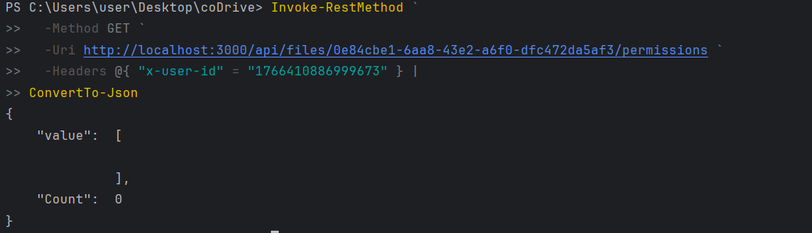
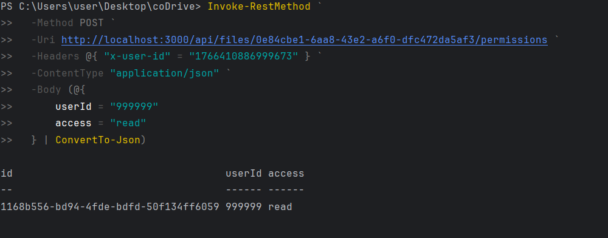
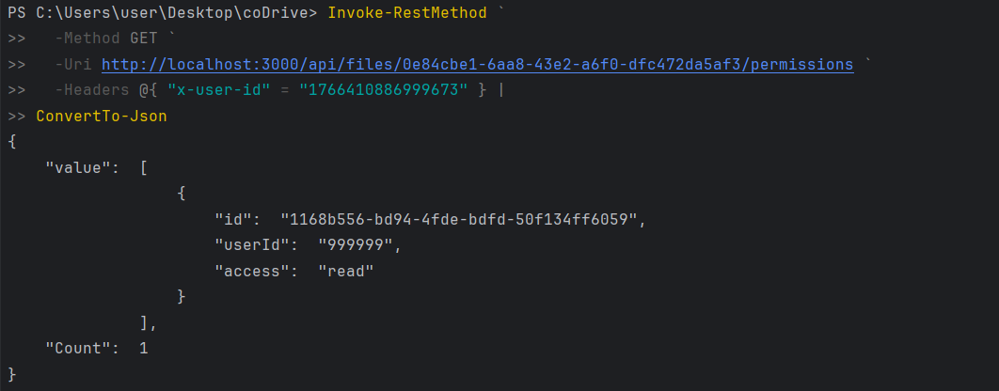
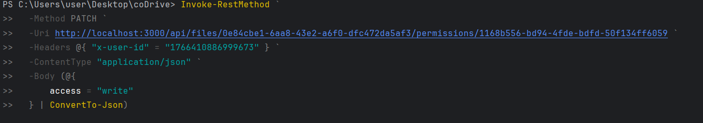
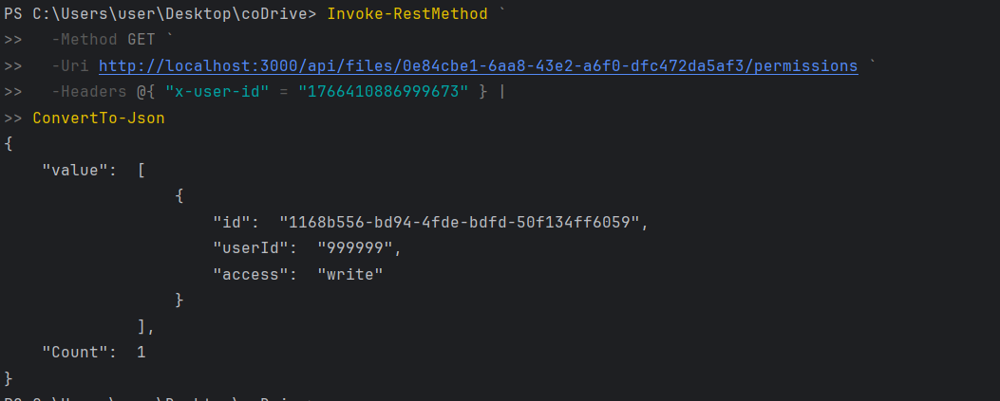
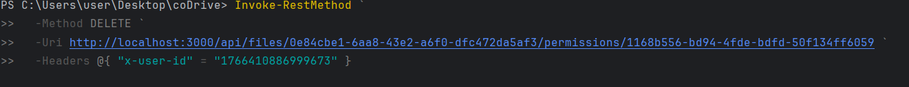
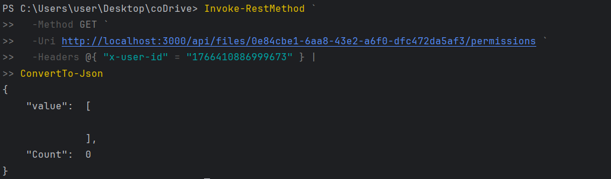

# coDrive Project

### **RESTful Web API, File Management & Distributed System Architecture**


This project implements a cloud-like file management system that exposes a RESTful Web API.
The system is built as an extension of Assignment 2 and adds a NodeJS-based web server on top
of the existing C++ server.

The NodeJS server exposes HTTP endpoints under `/api/*` and acts as a client to the C++ server
(from Assignment 2), which handles the actual file operations via TCP sockets.
This design allows reuse of the core business logic while adding a modern web interface.

### Assignment 3 introduces:
- A RESTful API implemented in NodeJS (Express, MVC architecture)
- User management and authentication using user IDs
- File and folder management endpoints
- A permission model for sharing files with other users
- Proper HTTP status codes and JSON responses
- Thread pool–based concurrency in the C++ server

All API endpoints return JSON responses and are designed according to the specification provided
in the assignment instructions.
---
### Project Structure

The project is organized into two main parts:  
the original C++ backend server (Assignment 2) and the new NodeJS web server layer
introduced in Assignment 3.
```
coDrive/
├─ src/
│  ├─ server/                 # C++ TCP server (from Assignment 2)
│  │  ├─ server.cpp            # TCP server entry point
│  │  ├─ ClientHandler.cpp    # Handles a single TCP client
│  │  └─ ClientHandler.h
│  │
│  ├─ commands/               # Command implementations (Assignment 2)
│  │                           # (Kept for backward compatibility)
│  │
│  └─ client/                 # C++ / Python clients (Assignment 2)
│
├─ web-server/                # === Assignment 3 Core ===
│  ├─ controllers/            # HTTP request handling logic
│  │  ├─ authController.js    # Authentication & tokens
│  │  ├─ filesController.js   # Files & folders CRUD
│  │  ├─ searchController.js  # Search endpoint
│  │  ├─ userController.js    # Users management
│  │  └─ healthController.js  # Health check endpoint
│  │
│  ├─ middleware/             # Express middlewares
│  │  ├─ authMiddleware.js    # User authentication via headers
│  │  └─ errorMiddleware.js   # Centralized error handling
│  │
│  ├─ models/                 # In-memory data models
│  │  ├─ user.model.js        # Users data structure
│  │  └─ fileSystem.model.js  # Files, folders & permissions
│  │
│  ├─ routes/                 # REST API routing
│  │  ├─ files.routes.js
│  │  ├─ user.routes.js
│  │  ├─ token.routes.js
│  │  ├─ search.js
│  │  ├─ health.routes.js
│  │  └─ index.js             # Routes aggregation
│  │
│  ├─ services/               # Integration services
│  │  ├─ tcpClient.js         # Communication with C++ TCP server
│  │  └─ cppServerClient.js   # Abstraction over TCP protocol
│  │
│  ├─ server.js               # Express server entry point
│  ├─ package.json
│  ├─ Dockerfile              # Web server Docker image
│  └─ package-lock.json
│
├─ docker-compose.yml         # Runs both Node.js web server & C++ server
├─ Dockerfile                 # C++ server Docker image
├─ CMakeLists.txt             # C++ build configuration
└─ README.md                  # Project documentation
> Note:  
 The C++ TCP server and command infrastructure from Assignment 2
 are kept unchanged and reused as a backend service.
 Assignment 3 focuses on exposing this functionality through
 a RESTful web API with authentication, permissions, and Docker support.
```
---
# How to Build & Run (Docker):
### Step 1: Running the Servers Using Docker

The entire system (C++ server + Node.js web server) is started using a single command.

Open a terminal in the root directory of the project (coDrive/).

Run the following command:
```
docker-compose up --build
```
What This Command Does:

- Builds the C++ server container

- Builds the Node.js web server container

- Starts both containers on the same Docker network

- Ensures the web server can communicate with the C++ server internally

After a successful startup, you should see:


### Step 2: User Registration & Authentication Flow

All interactions with the system are performed on behalf of a specific user.
Therefore, the first step after starting the servers is to create a user and authenticate

**To register a new user, send a POST request to the users endpoint.**

Example:
```
$user = Invoke-RestMethod `
  -Method POST `
  -Uri http://localhost:3000/api/users `
  -ContentType "application/json" `
  -Body (@{
      username = "demo"
      password = "123"
      name     = "Demo User"
  } | ConvertTo-Json)
  ```
What happens in this step:

- A new user is created in the system

- The server returns a user object

- The response includes a unique user ID

- The returned id uniquely identifies this user and is required in later steps.


**After the user is created, authenticate using the same credentials.**

Example:
```
$login = Invoke-RestMethod `
  -Method POST `
-Uri http://localhost:3000/api/tokens `
  -ContentType "application/json" `
-Body (@{
username = "demo"
password = "123"
} | ConvertTo-Json)
```
What happens in this step:

- The credentials are validated

- The server returns the userId associated with this user

- This userId represents the authenticated user context

All protected API endpoints require a user context.

The user ID returned from authentication must be passed in the request headers:

```
x-user-id: <USER_ID>
```

Example:
```
-Headers @{ "x-user-id" = "1766410886999673" }
```
From this point on:

- Every request (files, permissions, search, etc.)

- Is executed as this user

- And is authorized according to ownership and permissions
 
### Important Notes

- User IDs are generated dynamically and will differ between runs

- The README intentionally does not rely on fixed IDs

- Each step produces identifiers that must be reused in subsequent steps

- This flow is mandatory before performing any file or permission operations

## File Management Flow:

After a user is authenticated, all file and folder operations are executed in the context of that user.

Each request must include the x-user-id header, which identifies the acting user.

**Option 1 - List Root Files**

To retrieve all files and folders located at the root level of the user’s file system:
```
Invoke-RestMethod `
  -Method GET `
  -Uri http://localhost:3000/api/files `
  -Headers @{ "x-user-id" = <USER_ID> }
```
What happens in this step:

- The server returns all files owned by the user at the root level

- Initially, this list is empty for a new user

- The response also includes a count of returned items

**Option 2 - Create a New File or Folder**

To create a new file (or folder) under the root directory:
```
Invoke-RestMethod `
  -Method POST `
  -Uri http://localhost:3000/api/files `
  -Headers @{ "x-user-id" = <USER_ID> } `
  -ContentType "application/json" `
  -Body (@{
      name = "example"
  } | ConvertTo-Json)
```

What happens in this step:

- A new file entity is created

- The server generates a unique file ID

- The file is associated with the authenticated user

- The new file appears in subsequent list requests

- The returned file ID is required for all file-specific operations.

**Option 3 - Retrieve a Specific File by ID**

To fetch metadata of a specific file or folder:
```
Invoke-RestMethod `
  -Method GET `
  -Uri http://localhost:3000/api/files/<FILE_ID> `
  -Headers @{ "x-user-id" = <USER_ID> }
```
What happens in this step:

- The server returns the file’s metadata

- Includes name, type, owner, parent, and permissions

- Only accessible if the user owns the file or has permissions

**Option 4 - Update File Metadata**

To rename an existing file or folder:
```
Invoke-RestMethod `
  -Method PATCH `
-Uri http://localhost:3000/api/files/<FILE_ID> `
  -Headers @{ "x-user-id" = <USER_ID> } `
-ContentType "application/json" `
-Body (@{
name = "new-name"
} | ConvertTo-Json)
```

What happens in this step:

- The file name is updated

- No content is returned on success

- If the file does not exist or access is denied, an error is returned

**Option 5 - Error Handling (Invalid File ID)**

Attempting to update or access a non-existing file ID:
```
Invoke-RestMethod `
  -Method PATCH `
  -Uri http://localhost:3000/api/files/invalid-id `
  -Headers @{ "x-user-id" = <USER_ID> } `
  -ContentType "application/json" `
  -Body (@{
      name = "new-name"
  } | ConvertTo-Json)
```

Expected behavior:

- The server responds with a 404 Not Found

- An explanatory error message is returned

**Option 6 - Validation Errors**

Creating a file without mandatory fields:
```
Invoke-RestMethod `
  -Method POST `
  -Uri http://localhost:3000/api/files `
  -Headers @{ "x-user-id" = <USER_ID> } `
  -ContentType "application/json" `
  -Body (@{} | ConvertTo-Json)
```
Expected behavior:

- The server responds with 400 Bad Request

- Indicates that required fields are missing

**Option 7 - Delete a File**

To delete a file or folder:
```
Invoke-RestMethod `
  -Method DELETE `
  -Uri http://localhost:3000/api/files/<FILE_ID> `
  -Headers @{ "x-user-id" = <USER_ID> }
```

What happens in this step:

- The file is removed from the user’s file system

- The operation is permanent

- The deleted file no longer appears in list requests

## Permissions Management Flow:

The system supports fine-grained access control for files and folders.
Each file can have explicit permissions that grant other users access.

Permissions are always defined per file and per user.

**What Is a Permission?**

A permission object represents access granted to another user on a specific file.

Each permission contains:

- id – unique permission identifier

- userId – the user receiving access

- access – access level (read or write)

Only the file owner is allowed to manage permission

**Option 8 - List Permissions of a File**

To retrieve all permissions assigned to a specific file:
```
Invoke-RestMethod `
  -Method GET `
  -Uri http://localhost:3000/api/files/<FILE_ID>/permissions `
  -Headers @{ "x-user-id" = <OWNER_USER_ID> }
```

What happens in this step:

- The server returns all permissions associated with the file

- Initially, this list is empty

- The response includes a count of permission entries

**Option 9 - Grant Permission to Another User**

To grant access to another user:
```
Invoke-RestMethod `
  -Method POST `
  -Uri http://localhost:3000/api/files/<FILE_ID>/permissions `
  -Headers @{ "x-user-id" = <OWNER_USER_ID> } `
  -ContentType "application/json" `
  -Body (@{
      userId = "<TARGET_USER_ID>"
      access = "read"
  } | ConvertTo-Json)
```

What happens in this step:

- A new permission entry is created

- The target user gains access to the file

- The server returns a permission object with a unique permission ID

Supported access levels:

- read - read-only access

- write - read and modify access

**Option 10 - Update an Existing Permission**

To modify the access level of an existing permission:
```
Invoke-RestMethod `
  -Method PATCH `
  -Uri http://localhost:3000/api/files/<FILE_ID>/permissions/<PERMISSION_ID> `
  -Headers @{ "x-user-id" = <OWNER_USER_ID> } `
  -ContentType "application/json" `
  -Body (@{
      access = "write"
  } | ConvertTo-Json)
```
What happens in this step:

- The permission access level is updated

- Only the file owner can perform this operation

- If the permission ID does not exist, an error is returned

**Option 11 - Remove a Permission**

To revoke access from a user:
```
Invoke-RestMethod `
  -Method DELETE `
-Uri http://localhost:3000/api/files/<FILE_ID>/permissions/<PERMISSION_ID> `
-Headers @{ "x-user-id" = <OWNER_USER_ID> }
```

What happens in this step:

- The permission entry is deleted

- The target user immediately loses access

- The file owner always retains full access

### Authorization Rules:

Only the file owner can:

- Add permissions

- Modify permissions

- Delete permissions

Users with read access:

- Can view file metadata

Users with write access:

- Can update file metadata

## Search API Flow:

The system supports searching files and folders by name.
Search results are always scoped to the authenticated user and respect permission rules.

**Option 12 - Search Files by Query**

To search for files or folders whose name contains a given query string:
```
Invoke-RestMethod `
  -Method GET `
  -Uri http://localhost:3000/api/search/<QUERY> `
  -Headers @{ "x-user-id" = <USER_ID> }
```

What happens in this step:

- The server searches all files visible to the user

- A match occurs if the file or folder name contains the query string

Results include:

- Files owned by the user

- Files shared with the user via permissions

### Search Behavior Notes:

- Search is case-sensitive / case-insensitive according to the implementation

- Only files the user is authorized to access are returned

- Each result includes full file metadata (id, name, type, owner, etc.)

- An empty result set is returned if no matches are found
---
# Example Run (Docker):

**Services Startup and Server Initialization**

The c++ and web services are successfully built and started, with the server listening for connections and accepting a client.


**User Registration**

A new user is registered in the system via the /api/users endpoint, creating a unique user identity that will be used in all subsequent authenticated operations.


**User Authentication (Login)**

Using the credentials of the user created in the previous step, the user logs in via the /api/tokens endpoint and receives the userId that represents the authenticated context for all following requests.


**Initial File Listing**

Using the authenticated user ID obtained in the previous step, the root file list is requested, showing an empty directory for a newly created user.


**Creating a New File**

Based on the authenticated user context established earlier, a new file named `"aaa"` is created at the root level using the `/api/files` endpoint.


**Verifying File Creation**

Following the file creation step, the file list is retrieved again to confirm that the newly created file appears in the user’s root directory.


**Retrieve File Metadata by ID**

Using the file ID obtained in the previous listing step, the metadata of the specific file is retrieved to demonstrate direct access to a single resource.


**Create an Additional File**

Still using the same authenticated user, a second file ("bbbb") is created to demonstrate handling multiple files under the same user context.


**List Files After Adding a Second File**

The file list is retrieved again to verify that both files created in the previous steps are present in the root directory.


**Update File Name**

Using the file ID of the second file from the previous step, a PATCH request is sent to update the file name, demonstrating file metadata modification.


**Verify Updated File State**

The file list is retrieved one final time to confirm that the file update operation was successful and the new file name is reflected in the system.


**File Update on Non-Existing Resource**

A PATCH /api/files/{id} request fails with an error indicating that the specified file or folder does not exist.


**File Creation Validation Error**

An attempt to create a file via POST /api/files fails because the required file name is missing from the request body.


**File Deletion**

A file is deleted using a DELETE /api/files/{id} request with the authenticated user context provided in the request headers.


**Updated File Listing**

The authenticated user retrieves the file list via GET /api/files, showing the newly created file in the root directory.


**File Permissions Listing**

The authenticated user retrieves the permissions for a specific file via GET /api/files/{id}/permissions, resulting in an empty permissions list.


**Grant File Permission**

A permission is added to a file via POST /api/files/{id}/permissions, granting read access to another user.


**Updated File Permissions**

The authenticated user retrieves the file permissions via GET /api/files/{id}/permissions, showing the newly granted access entry.


**Update File Permission**

An existing file permission is updated via PATCH /api/files/{id}/permissions/{permissionId}, changing the access level to write.


**Verified Permission Update**

The file permissions are retrieved via GET /api/files/{id}/permissions, confirming that the access level was successfully updated to write.
ץ

**Revoke File Permission**

A file permission is removed via DELETE /api/files/{id}/permissions/{permissionId}, revoking the previously granted access.


**Permissions Removed Confirmation**

The file permissions are retrieved via GET /api/files/{id}/permissions, confirming that all permissions have been successfully removed.
