# coDrive Project

### **RESTful Web API, File Management & Full-Stack Distributed System**

This project implements a cloud-like file management system that exposes a RESTful Web API
and a modern web-based client interface.

The system is built as a continuation of Assignments 2 and 3, and in Assignment 4 it is
extended into a full-stack distributed system, combining:

- C++ multi-threaded backend server

- NodeJS-based RESTful web server

- React-based client application

-Full Docker and docker-compose deployment

The NodeJS server exposes HTTP endpoints under ```/api/*``` and acts as a client to the C++ server
(from Assignments 2–3), which performs the actual file operations via TCP sockets.
This layered architecture enables reuse of the core business logic while adding
authentication, authorization, and a user-friendly web UI.


### Assignment 4 extends the system with:
- A React web client that consumes the RESTful API

- Full JWT-based authentication and session handling

- A complete file manager UI (folders, files, previews, sharing)

- Support for Starred, Trash, Recent and Shared views

- Integration of client, web server and C++ server using Docker

- A unified docker-compose configuration for running the entire system

- End-to-end testing and validation of the distributed architecture

All API endpoints return JSON responses and follow RESTful design principles.
The system is fully containerized and can be executed locally using a single
```docker-compose``` up command, as required by the assignment specification.
---
### Project Structure

This project is composed of three main layers that build incrementally on each other.
At its core, it reuses the C++ TCP server developed in Assignment 2, which implements the core file-system logic and command handling.
On top of this backend, a Node.js RESTful web server (introduced in Assignment 3) acts as a middleware layer, exposing the C++ functionality through HTTP APIs and managing authentication, users, and permissions.
Finally, Assignment 4 adds a full React-based frontend, providing a modern web user interface that consumes the REST API and enables end-to-end interaction with the system.
```
coDrive/
├─ src/
│  ├─ server/                     # C++ TCP server (Assignment 2 – unchanged)
│  │  ├─ server.cpp               # TCP server entry point
│  │  ├─ ClientHandler.cpp        # Handles a single TCP client
│  │  └─ ClientHandler.h
│  │
│  ├─ commands/                   # Command implementations (Assignment 2)
│  │                               # Kept for backward compatibility
│  │
│  └─ client/                     # C++ / Python clients (Assignment 2)
│
├─ web-server/                    # Node.js REST API (Assignments 3–4)
│  ├─ controllers/                # HTTP request handlers
│  │  ├─ authController.js        # Authentication & token handling
│  │  ├─ filesController.js       # Files & folders CRUD logic
│  │  ├─ searchController.js      # Search endpoints
│  │  ├─ userController.js        # User management
│  │  └─ healthController.js      # Health check endpoint
│  │
│  ├─ middleware/                 # Express middlewares
│  │  ├─ authMiddleware.js        # Authentication & authorization
│  │  └─ errorMiddleware.js       # Centralized error handling
│  │
│  ├─ models/                     # In-memory data models
│  │  ├─ user.model.js            # Users data structure
│  │  └─ fileSystem.model.js      # Files, folders & permissions model
│  │
│  ├─ routes/                     # REST API routing
│  │  ├─ files.routes.js
│  │  ├─ user.routes.js
│  │  ├─ token.routes.js
│  │  ├─ search.routes.js
│  │  ├─ health.routes.js
│  │  └─ index.js                 # Routes aggregation
│  │
│  ├─ services/                   # Backend services
│  │  ├─ tcpClient.js             # Low-level TCP communication
│  │  └─ cppServerClient.js       # Abstraction over C++ server protocol
│  │
│  ├─ server.js                   # Express server entry point
│  ├─ Dockerfile                  # Web server Docker image
│  ├─ package.json
│  └─ package-lock.json
│
├─ web-client/                    # React frontend (Assignment 4)
│  ├─ public/
│  │
│  ├─ src/
│  │  ├─ assets/                  # Static assets (icons, images)
│  │
│  │  ├─ components/
│  │  │  ├─ auth/
│  │  │  │  └─ ProtectedRoute.jsx # Route protection (auth guard)
│  │  │
│  │  │  ├─ drive/                # Drive UI components
│  │  │  │  ├─ FileCard.jsx       # Single file / folder card
│  │  │  │  ├─ FileGrid.jsx       # Grid layout for files
│  │  │  │  ├─ FileViewer.jsx     # File preview modal
│  │  │  │  ├─ ShareModal.jsx     # File sharing dialog
│  │  │  │  └─ drive.css          # Drive-specific styles
│  │  │
│  │  │  └─ layout/               # Application layout
│  │  │     ├─ AppLayout.jsx      # Main app shell
│  │  │     ├─ SideMenu.jsx       # Left navigation menu
│  │  │     ├─ SideMenu.css
│  │  │     ├─ TopBar.jsx         # Top navigation bar
│  │  │     └─ TopBar.css
│  │
│  │  ├─ pages/                   # Application pages
│  │  │  ├─ DrivePage.jsx         # Main drive view
│  │  │  ├─ RecentPage.jsx        # Recent files
│  │  │  ├─ StarredPage.jsx       # Starred files
│  │  │  ├─ SharedPage.jsx        # Shared files
│  │  │  ├─ TrashPage.jsx         # Trash (soft delete)
│  │  │  ├─ LoginPage.jsx         # Login page
│  │  │  └─ RegisterPage.jsx      # Registration page
│  │
│  │  ├─ services/                # Frontend API services
│  │  │  ├─ api.js                # Axios / fetch wrapper
│  │  │  ├─ authService.js        # Authentication API
│  │  │  └─ filesService.js       # Files API
│  │
│  │  ├─ App.js                   # React root component
│  │  ├─ App.css
│  │  ├─ index.js                 # React entry point
│  │  ├─ index.css
│  │  └─ reportWebVitals.js
│  │
│  ├─ Dockerfile                  # Frontend Docker image
│  ├─ package.json
│  └─ package-lock.json
│
├─ docker-compose.yml             # Runs C++ server, web-server & web-client
├─ Dockerfile                     # C++ server Docker image
├─ CMakeLists.txt                 # C++ build configuration
├─ .gitignore
└─ README.md
```
---
# How to Build & Run (Docker):
### Step 1: Running the Servers Using Docker

The entire system (C++ server + Node.js web server) is started using a single command.

Open a terminal in the root directory of the project (coDrive/).

Run the following command:
```
docker-compose up --build
```
What This Command Does:

- Builds the C++ server container

- Builds the Node.js web server container 

- Starts the containers on the same Docker network

- Ensures the web server can communicate with the C++ server internally

After a successful startup, you should see:
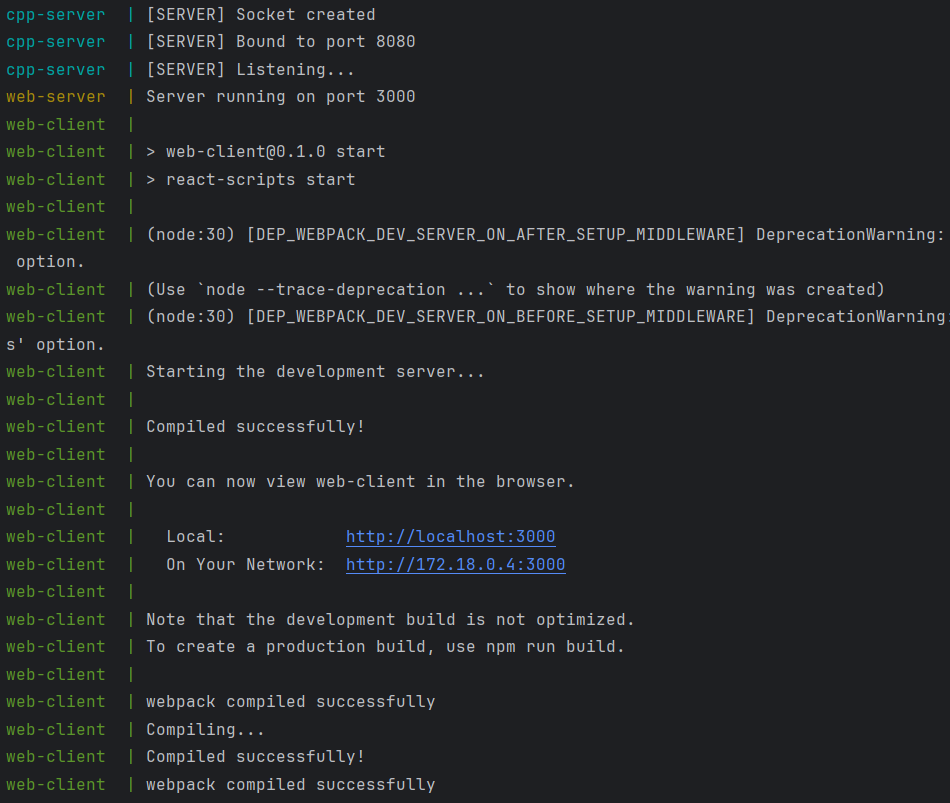

### Step 2: Starting the Web Client

The web client is started using `npm start` from the `web-client` directory.
At this stage, the development server initialization begins.

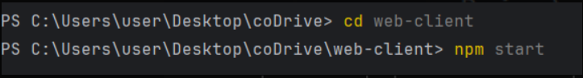

If port 3000 is already occupied, the development server detects the conflict
and prompts the user to run the application on a different available port.

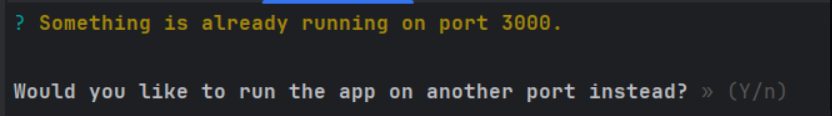

After approving the port change, the application is compiled successfully
and becomes accessible via a new local and network URL.

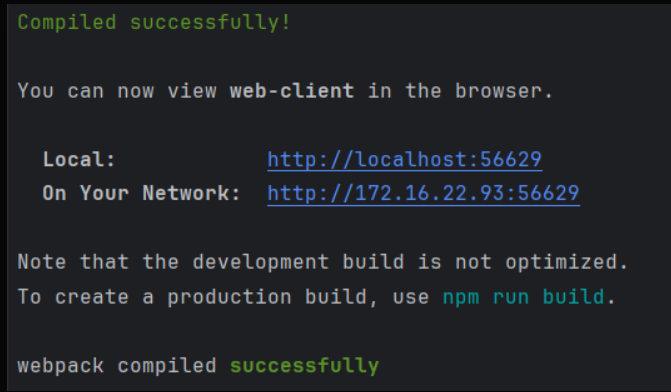

### Step 3: Registration and log in

When launching the application, users are initially presented with the Sign In screen.
Existing users can log in by entering their username and password.

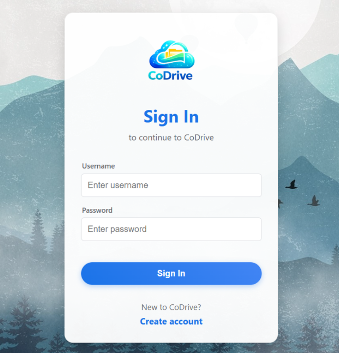

New users who do not yet have an account can proceed to the registration page by clicking the “Create account” button.
On the registration screen, users are required to fill in the necessary details, including username, full name, email, phone number, birth date, and password.

Additionally, the registration process allows users to upload a profile image, providing a more personalized experience.

Once the registration is completed successfully, users can log in and access the main application features.

The system provides real-time validation feedback on both the sign-in and registration screens, clearly indicating invalid or missing input fields to guide the user in correcting errors.

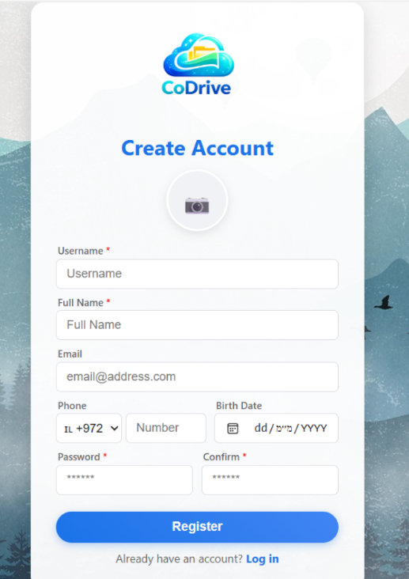

### Step 4: Drive Page Overview

After successful registration and login with valid credentials, users are redirected to the Drive page, which serves as the main workspace of the application.

At the top of the page, a search bar allows users to search for files ,folders and images by content and by name.
Next to it, the “New” button enables the creation of new items such as files ,folders and images.

The top-right section includes a Dark Mode toggle, allowing users to switch between light and dark themes, a user profile indicator, and a Logout button to safely exit the application.

On the left side, a side navigation menu provides quick access to different views:

My Drive - displays all files and folders owned by the user.

Recent - shows recently accessed or modified items.

Starred - contains files marked as favorites for quick access.

Shared - lists files and folders shared with the user by others.

Trash - stores deleted items that can be restored or permanently removed.

The main content area displays the files and folders according to the selected section.
If no files are available, an informative message is shown to indicate an empty state.

This layout provides an intuitive and user-friendly file management experience similar to modern cloud storage systems.

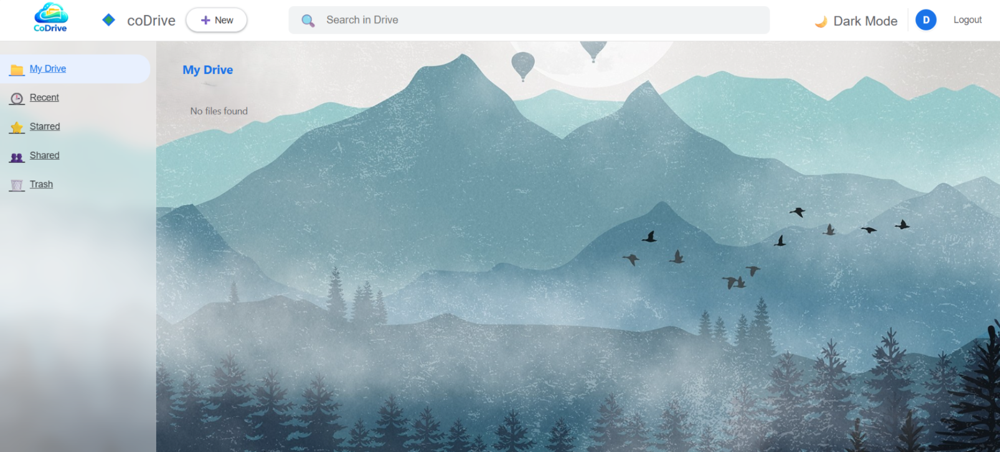

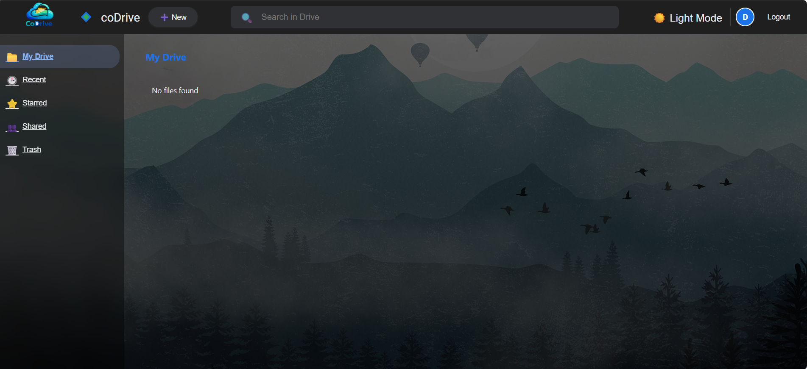

### Step 4: Drive Page Overview

The system supports three main types of items that users can create and manage within the Drive: text files, image files, and folders.
Each type provides dedicated functionality tailored to its content, enabling a flexible and intuitive file management experience.

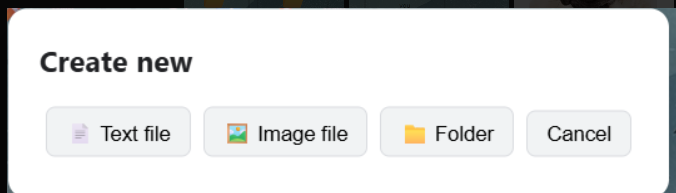

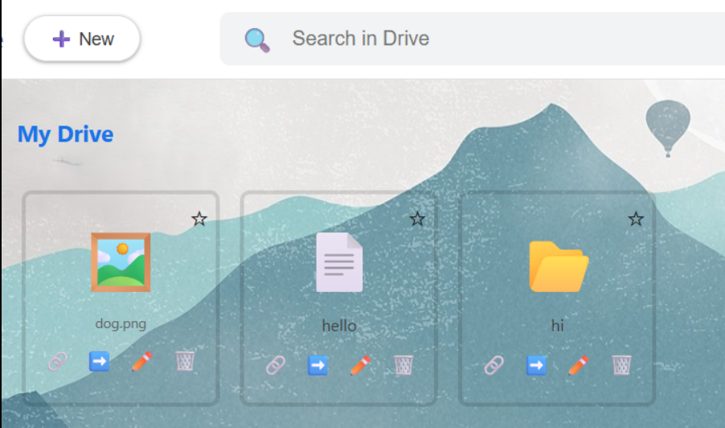

**Text Files**

Text files can be created directly from the New menu.
When opening a text file, an editor modal is displayed, allowing users to write, edit, and update the file’s content.
Changes can be saved in real time, and the updated content is persisted on the server.
Text files are also fully searchable, both by their file name and by their internal content.

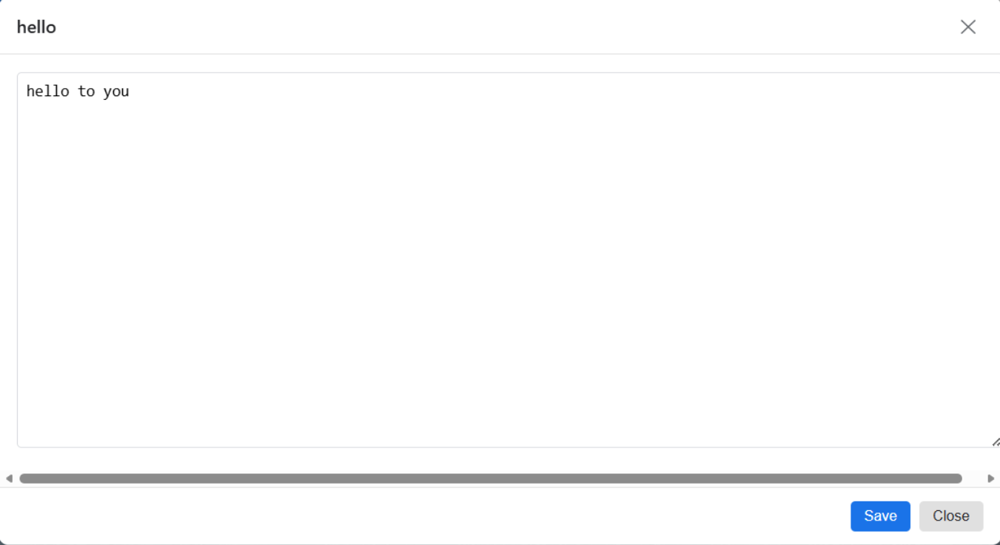

**Image Files**

Image files can be uploaded and managed through the Drive interface.
When an image file is opened, a preview modal displays the image in full resolution.
The system allows users to replace the image with a new one while keeping the same file entry, enabling easy updates without deleting and recreating files.

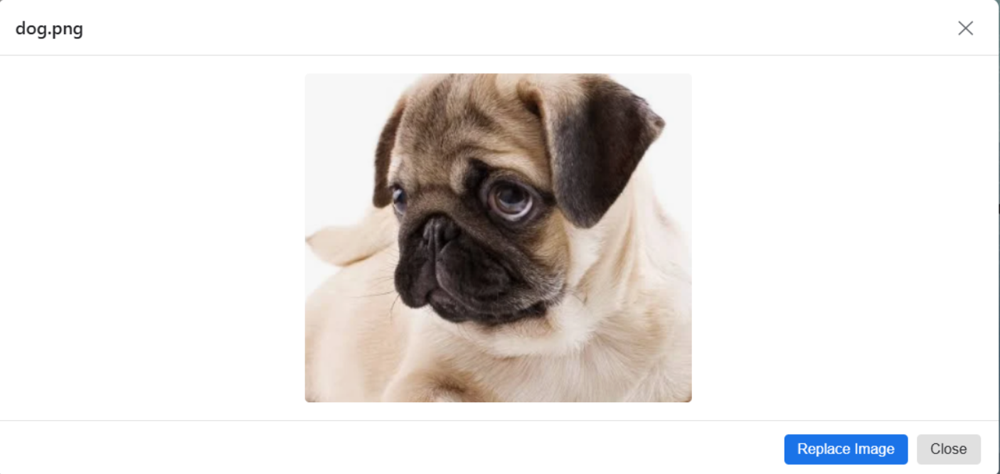

**Folders**

Folders can be created to organize files hierarchically.
Users can navigate into folders, create subfolders, and manage files within them.
The breadcrumb navigation at the top of the page reflects the current path, allowing quick navigation back to parent directories.
Folders can be renamed, moved, shared, starred, or deleted just like files.

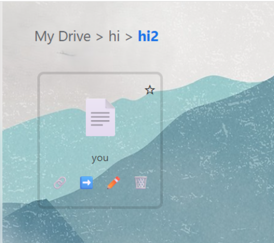

**Search Functionality**

The search bar at the top of the Drive enables powerful searching across the user’s files and folders.
Users can search:

- By file or folder name

- By text content inside text files

Search results are displayed dynamically and may include files and folders from different locations, providing fast access to relevant data without manual navigation.

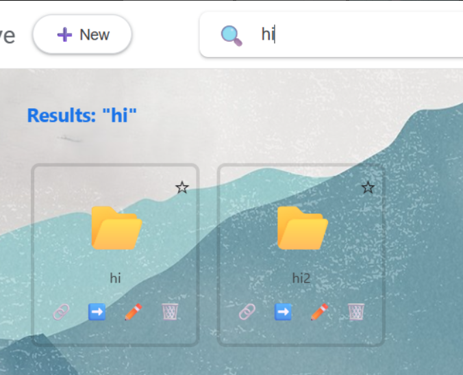

### Step 5: File Management Operations

#### User Interactions

The system provides a complete set of file management operations, fully implemented on top of the RESTful API developed in Assignment 3.
All user actions in the frontend are translated into API calls handled by the Node.js web server, which in turn communicates with the C++ backend server to perform the actual file system operations.

Each file ,folder or image in the Drive is represented by a card, with a dedicated action toolbar displayed beneath it.
This toolbar allows users to manage items efficiently and consistently across all views.

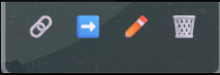


- **Share**
Opens a sharing dialog that allows the user to grant access to other users by username.
Permissions can be assigned as read or write, according to the sharing model implemented in Assignment 3.
Shared users are displayed in the dialog and can be removed at any time.

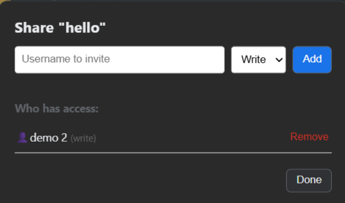

- **Move**
Opens a move dialog that allows the user to relocate the file or folder to another directory.
Users may specify a target folder name or quickly move the item back to the root directory (“My Drive”).
This operation updates the item’s parent reference via the API.

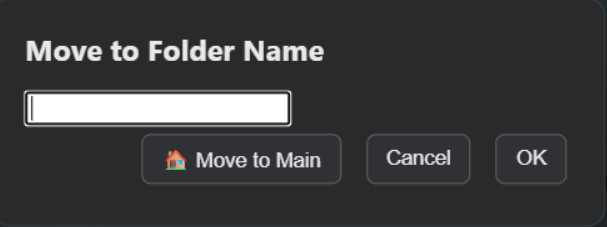

- **Rename**
Opens a rename dialog that allows changing the file or folder name.
Validation is applied to prevent empty or invalid names, and the change is persisted through the backend API.

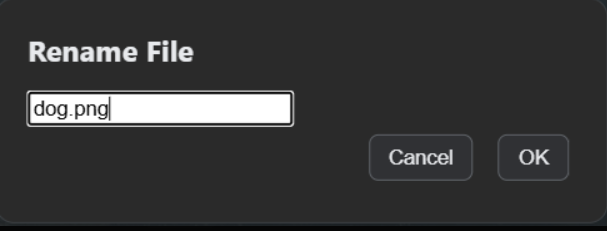

- **Delete (Move to Trash)**
Moves the selected item to the Trash instead of deleting it permanently.
This implements a soft delete mechanism, allowing recovery at a later stage.

#### Trash Management

The Trash section provides additional item management options:

- **Restore**
Restores the item to its original location before deletion.

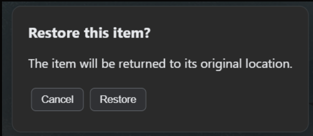

- **Delete Forever**
Permanently removes the item from the system.
This action is irreversible and requires explicit user confirmation.

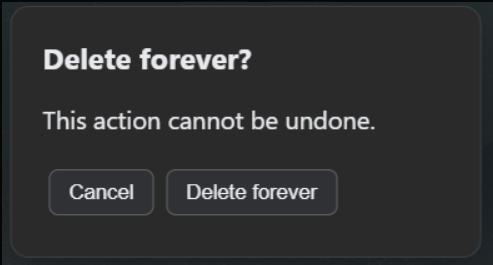

This design ensures data safety while still allowing permanent cleanup when needed.

#### Starred Items

Each file or folder card includes a star icon that allows users to mark items as favorites.
Starred items appear in the Starred section of the side menu, enabling quick access to frequently used content.

The star state is stored in the backend and reflected consistently across all views.

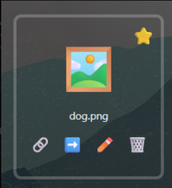

#### Side Navigation Menu

The side menu enables seamless navigation between different logical views of the user’s data:

- **My Drive**
Displays all files and folders owned by the user, organized hierarchically.


- **Recent**
Shows files and folders that were recently accessed or modified.

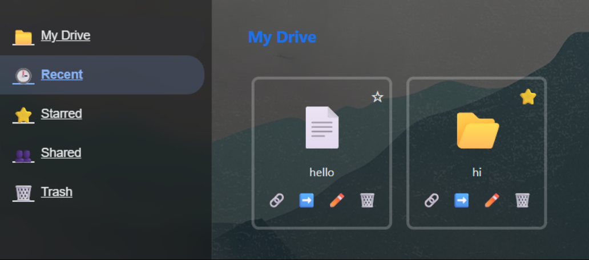

- **Starred**
Displays all items marked with a star by the user.

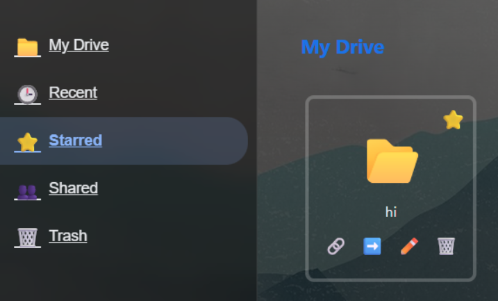


- **Shared**
Lists files and folders that were shared with the user by others, based on the permission model.

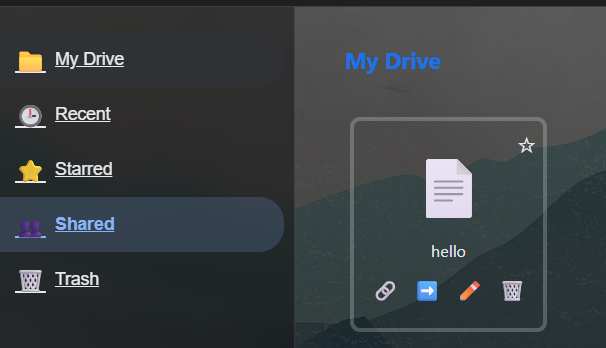

- **Trash**
Displays deleted items that can be restored or permanently removed.

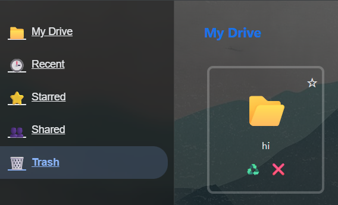

Switching between these sections does not duplicate data, but rather filters and presents the same underlying file system state according to the selected view.
