# coDrive Project

### **RESTful Web API, File Management & Distributed System Architecture**


This project implements a cloud-like file management system that exposes a RESTful Web API.
The system is built as an extension of Assignment 2 and adds a NodeJS-based web server on top
of the existing C++ server.

The NodeJS server exposes HTTP endpoints under `/api/*` and acts as a client to the C++ server
(from Assignment 2), which handles the actual file operations via TCP sockets.
This design allows reuse of the core business logic while adding a modern web interface.

### Assignment 3 introduces:
- A RESTful API implemented in NodeJS (Express, MVC architecture)
- User management and authentication using user IDs
- File and folder management endpoints
- A permission model for sharing files with other users
- Proper HTTP status codes and JSON responses
- Thread pool–based concurrency in the C++ server

All API endpoints return JSON responses and are designed according to the specification provided
in the assignment instructions.
---
### Project Structure

The project is organized into two main parts:  
the original C++ backend server (Assignment 2) and the new NodeJS web server layer
introduced in Assignment 3.
```
coDrive/
├─ src/
│  ├─ server/                 # C++ TCP server (from Assignment 2)
│  │  ├─ server.cpp            # TCP server entry point
│  │  ├─ ClientHandler.cpp    # Handles a single TCP client
│  │  └─ ClientHandler.h
│  │
│  ├─ commands/               # Command implementations (Assignment 2)
│  │                           # (Kept for backward compatibility)
│  │
│  └─ client/                 # C++ / Python clients (Assignment 2)
│
├─ web-server/                # Assignment 3 Core 
│  ├─ controllers/            # HTTP request handling logic
│  │  ├─ authController.js    # Authentication & tokens
│  │  ├─ filesController.js   # Files & folders CRUD
│  │  ├─ searchController.js  # Search endpoint
│  │  ├─ userController.js    # Users management
│  │  └─ healthController.js  # Health check endpoint
│  │
│  ├─ middleware/             # Express middlewares
│  │  ├─ authMiddleware.js    # User authentication via headers
│  │  └─ errorMiddleware.js   # Centralized error handling
│  │
│  ├─ models/                 # In-memory data models
│  │  ├─ user.model.js        # Users data structure
│  │  └─ fileSystem.model.js  # Files, folders & permissions
│  │
│  ├─ routes/                 # REST API routing
│  │  ├─ files.routes.js
│  │  ├─ user.routes.js
│  │  ├─ token.routes.js
│  │  ├─ search.js
│  │  ├─ health.routes.js
│  │  └─ index.js             # Routes aggregation
│  │
│  ├─ services/               # Integration services
│  │  ├─ tcpClient.js         # Communication with C++ TCP server
│  │  └─ cppServerClient.js   # Abstraction over TCP protocol
│  │
│  ├─ server.js               # Express server entry point
│  ├─ package.json
│  ├─ Dockerfile              # Web server Docker image
│  └─ package-lock.json
│
├─ docker-compose.yml         # Runs both Node.js web server & C++ server
├─ Dockerfile                 # C++ server Docker image
├─ CMakeLists.txt             # C++ build configuration
└─ README.md                  # Project documentation
> Note:  
 The C++ TCP server and command infrastructure from Assignment 2
 are kept unchanged and reused as a backend service.
 Assignment 3 focuses on exposing this functionality through
 a RESTful web API with authentication, permissions, and Docker support.
```
---
# How to Build & Run (Docker):
### Step 1: Running the Servers Using Docker

The entire system (C++ server + Node.js web server) is started using a single command.

Open a terminal in the root directory of the project (coDrive/).

Run the following command:
```
docker-compose up --build
```
What This Command Does:

- Builds the C++ server container

- Builds the Node.js web server container

- Starts both containers on the same Docker network

- Ensures the web server can communicate with the C++ server internally

After a successful startup, you should see:
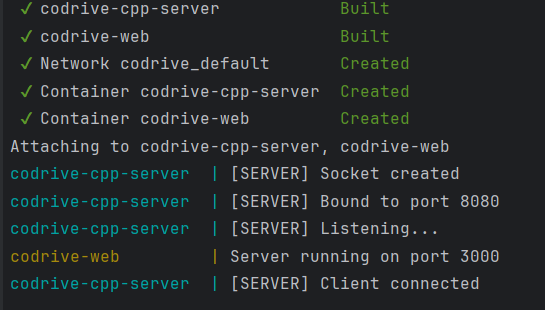

### Step 2: User Registration & Authentication Flow

All interactions with the system are performed on behalf of a specific user.
Therefore, the first step after starting the servers is to create a user and authenticate

**To register a new user, send a POST request to the users endpoint.**

Example:
```
$user = Invoke-RestMethod `
  -Method POST `
  -Uri http://localhost:3000/api/users `
  -ContentType "application/json" `
  -Body (@{
      username = "demo"
      password = "123"
      name     = "Demo User"
  } | ConvertTo-Json)
  ```
What happens in this step:

- A new user is created in the system

- The server returns a user object

- The response includes a unique user ID

- The returned id uniquely identifies this user and is required in later steps.

- Store the user id for later use:
 ```
$USER_ID = $user.id
 ```
**After the user is created, authenticate using the same credentials.**

Example:
```
$login = Invoke-RestMethod `
  -Method POST `
  -Uri http://localhost:3000/api/tokens `
  -ContentType "application/json" `
  -Body (@{
      username = "demo"
      password = "123"
  } | ConvertTo-Json)
```
What happens in this step:

- The credentials are validated

- The server returns the userId associated with this user

- This userId represents the authenticated user context

All protected API endpoints require a user context.

The user ID returned from authentication must be passed in the request headers:

```
x-user-id: <USER_ID>
```

Example:
```
$H = @{ "x-user-id" = $USER_ID }
```
From this point on:

- Every request (files, permissions, search, etc.)

- Is executed as this user

- And is authorized according to ownership and permissions
 
### Important Notes

- User IDs are generated dynamically and will differ between runs

- The README intentionally does not rely on fixed IDs

- Each step produces identifiers that must be reused in subsequent steps

- This authentication flow is mandatory before performing any file or permission operations

## File Management Flow:

After a user is authenticated, all file and folder operations are executed in the context of that user.

Each request must include the x-user-id header, which identifies the acting user.

**Option 1 - List Root Files**

To retrieve all files and folders located at the root level of the user’s file system:
```
Invoke-RestMethod `
  -Method GET `
  -Uri http://localhost:3000/api/files `
  -Headers $H
```
What happens in this step:

- Returns all root-level files and folders owned by the user

- Initially empty for a new user

**Option 2 - Create a New File or Folder**

To create a new file (or folder) under the root directory:
```
Invoke-RestMethod `
  -Method POST `
  -Uri http://localhost:3000/api/files `
  -Headers $H `
  -ContentType "application/json" `
  -Body (@{
      name = "docs"
  } | ConvertTo-Json)
```

What happens in this step:

- If type is omitted, the server creates a folder by default

- The response includes a generated file/folder ID

**Option 3 - Retrieve a Specific File by ID**

To fetch metadata of a specific file or folder:
```
Invoke-RestMethod `
  -Method GET `
  -Uri http://localhost:3000/api/files/<FILE_ID> `
  -Headers $H
```
What happens in this step:

- Returns file or folder metadata

- If the entity is a folder, its children are included

- Accessible only if the user owns the file or has permissions

**Option 4 – Update File or Folder**

To rename an existing file or folder:
```
Invoke-RestMethod `
  -Method PATCH `
  -Uri http://localhost:3000/api/files/<FILE_ID> `
  -Headers $H `
  -ContentType "application/json" `
  -Body (@{
      name = "new-name"
  } | ConvertTo-Json)
```

What happens in this step:

- File or folder name is updated

- Server responds with 204 No Content

- No response body is returned on success

Note:
When using Invoke-RestMethod, a 204 No Content response produces no output.
This behavior is expected and indicates a successful operation.

**Option 5 - Error Handling (Invalid File ID)**

Attempting to update or access a non-existing file ID:
```
Invoke-RestMethod `
  -Method PATCH `
  -Uri http://localhost:3000/api/files/invalid-id `
  -Headers $H `
  -ContentType "application/json" `
  -Body (@{
      name = "new-name"
  } | ConvertTo-Json)
```

Expected behavior:

- The server responds with a 404 Not Found

- An explanatory error message is returned

**Option 6 - Validation Errors**

Creating a file without mandatory fields:
```
Invoke-RestMethod `
  -Method POST `
  -Uri http://localhost:3000/api/files `
  -Headers $H `
  -ContentType "application/json" `
  -Body (@{} | ConvertTo-Json)
```
Expected behavior:

- The server responds with 400 Bad Request

- Indicates that required fields are missing

**Option 7 - Delete a File**

To delete a file or folder:
```
Invoke-RestMethod `
  -Method DELETE `
  -Uri http://localhost:3000/api/files/<FILE_ID> `
  -Headers $H
```

What happens in this step:

- File or folder is permanently deleted

- Deletion is recursive for folders

- Server responds with 204 No Content

## Permissions Management Flow:

The system supports fine-grained access control for files and folders.

A permission object contains:

- id - unique permission identifier

- userId - user receiving access

- access - read or write

Only the file owner may manage permissions.

**Option 8 - List Permissions of a File**

To retrieve all permissions assigned to a specific file:
```
Invoke-RestMethod `
  -Method GET `
  -Uri http://localhost:3000/api/files/<FILE_ID>/permissions `
  -Headers $H
```

What happens in this step:

- The server returns all permissions associated 

- Initially, this list is empty

- The response includes a count of permission entries

**Option 9 - Grant Permission to Another User**

To grant access to another user:
```
Invoke-RestMethod `
  -Method POST `
  -Uri http://localhost:3000/api/files/<FILE_ID>/permissions `
  -Headers $H `
  -ContentType "application/json" `
  -Body (@{
      userId = "<TARGET_USER_ID>"
      access = "read"
  } | ConvertTo-Json)
```

What happens in this step:

- A new permission entry is created

- The target user gains access 

Supported access levels:

- read - read-only access

- write - read and modify access

**Option 10 - Update an Existing Permission**

To modify the access level of an existing permission:
```
Invoke-RestMethod `
  -Method PATCH `
  -Uri http://localhost:3000/api/files/<FILE_ID>/permissions/<PERMISSION_ID> `
  -Headers $H `
  -ContentType "application/json" `
  -Body (@{
      access = "write"
  } | ConvertTo-Json)
```
What happens in this step:

- The permission access level is updated

- Only the file owner can perform this operation

**Option 11 - Remove a Permission**

To revoke access from a user:
```
Invoke-RestMethod `
  -Method DELETE `
  -Uri http://localhost:3000/api/files/<FILE_ID>/permissions/<PERMISSION_ID> `
  -Headers $H
```

What happens in this step:

- The permission entry is deleted

### Authorization Rules:

Only the file owner can:

- Add permissions

- Modify permissions

- Delete permissions

Users with read access:

- Can view file metadata

Users with write access:

- Can update file metadata

## Search API Flow:

The system supports searching files and folders by name.
Search results are always scoped to the authenticated user and respect permission rules.

**Option 12 - Search Files by Query**

To search for files or folders whose name contains a given query string:
```
Invoke-RestMethod `
  -Method GET `
  -Uri http://localhost:3000/api/search/<QUERY> `
  -Headers $H
```

**Search Notes:**

- Search is case-insensitive

- Results are scoped to the authenticated user

- Files shared via permissions are included

- Binary files (e.g. images) are matched by name only

- An empty result set is returned if no matches are found

### Final Notes

- Successful operations that return 204 No Content do not display output in PowerShell

- This behavior is correct and indicates success

- The system is fully Dockerized and behaves identically across platforms
---
# Example Run (Docker):

**Services Startup and Server Initialization**

The c++ and web services are successfully built and started, with the server listening for connections and accepting a client.


**User Registration via REST API**

A new user is created by sending a POST request to the /api/users endpoint, and the server returns a user object containing a unique identifier that will be used for all subsequent authenticated operations.
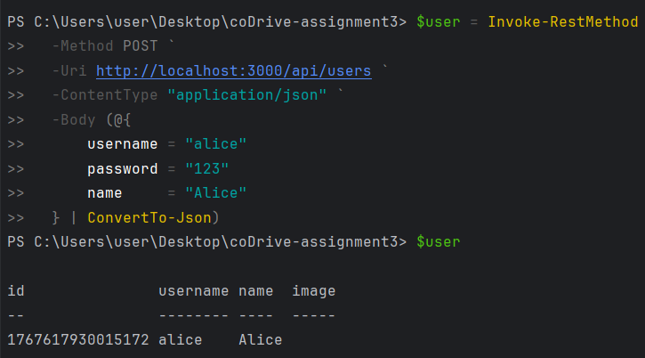

**User Authentication and Session Setup**

The user authenticates via the /api/tokens endpoint using valid credentials, receives the associated userId, and stores it in a request header to be used as the authenticated context for all subsequent API calls.
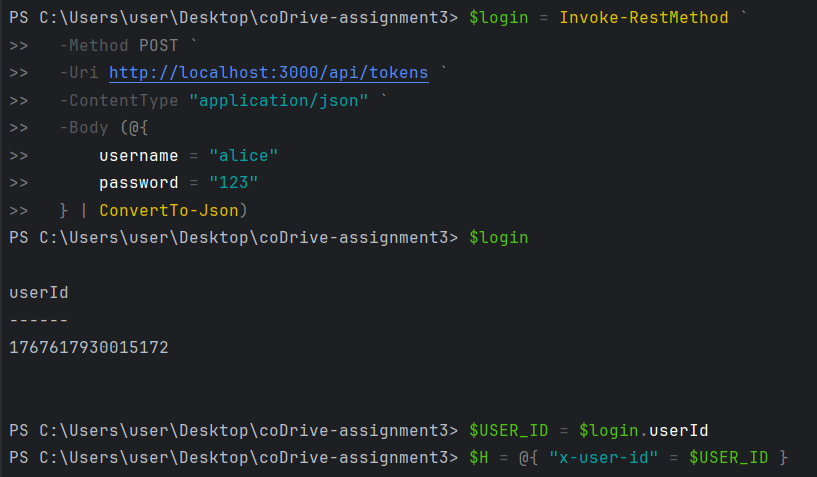


**List Root Files**

A GET request is sent to the /api/files endpoint using the authenticated user header, returning an empty result set that confirms the user’s root directory initially contains no files or folders.
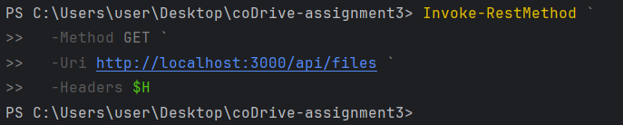


**Create Root Folder**

A new folder named docs is created at the root level by sending a POST request to the /api/files endpoint, and the server returns the folder metadata including its unique identifier and ownership information.
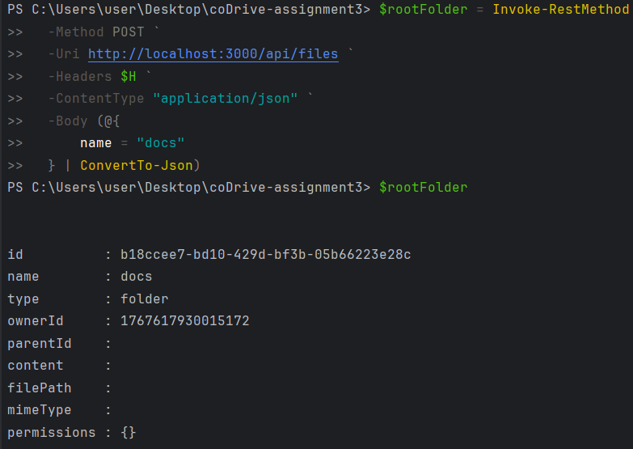


**Create Nested Folder**

A subfolder named projects is created inside the existing docs folder by specifying the parent folder ID, demonstrating hierarchical folder organization within the file system.
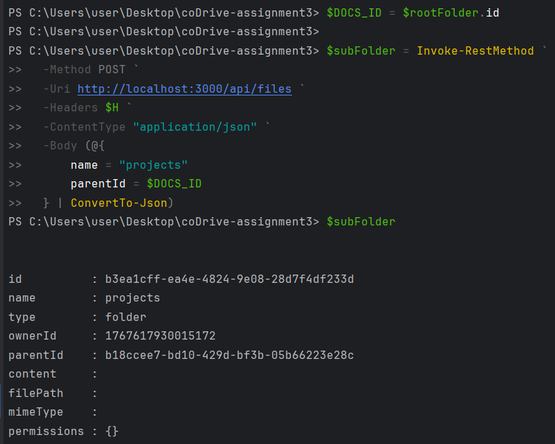

**Create Text File**

A text file named notes.txt is created inside the docs folder by sending a POST request with file metadata and textual content, and the server returns the file object including its content and MIME type.
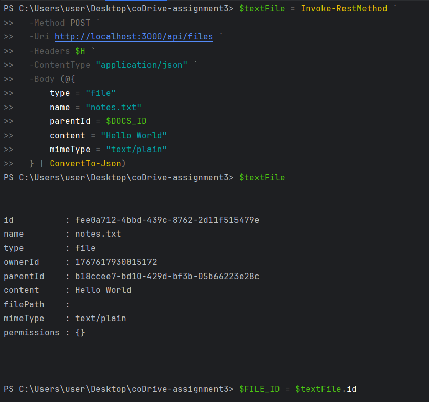

**View Folder Contents**

The contents of the docs folder are retrieved using a GET request, returning the folder metadata along with its child entities, including the nested projects folder and the notes.txt file.
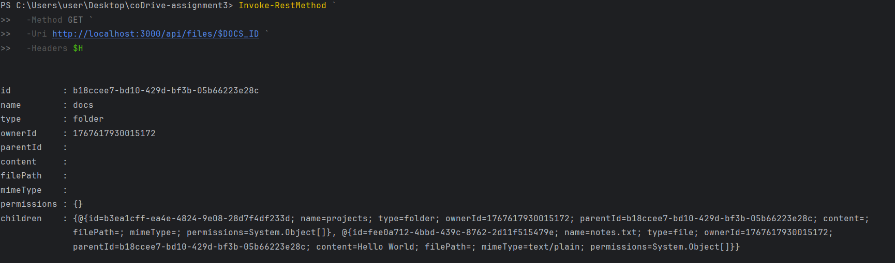

**Update File Content**

A PATCH request is sent to update the content of the existing text file, successfully modifying the file’s stored data and completing the operation with a 204 No Content response.
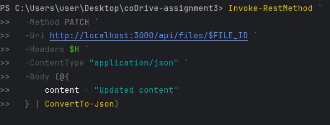

**Search Files by Query**

A search request is performed using the /api/search/note endpoint, returning the notes.txt file whose name matches the query and reflecting the updated file content in the response.
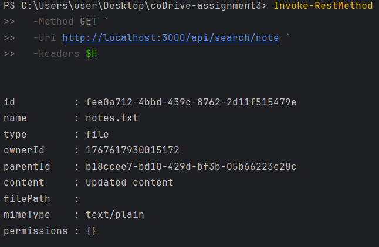

**Grant File Permission to Another User**

A second user is created and granted read access to an existing file by sending a POST request to the /api/files/{fileId}/permissions endpoint, demonstrating user-to-user file sharing through explicit permissions.
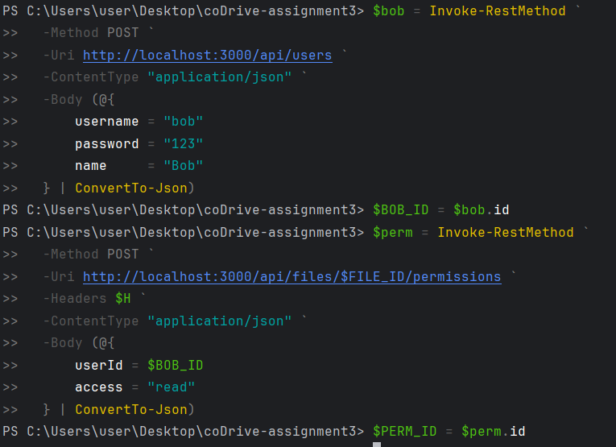

**Update File Permission**

An existing permission entry is updated by changing the access level from read to write using a PATCH request, allowing the target user to modify the shared file.
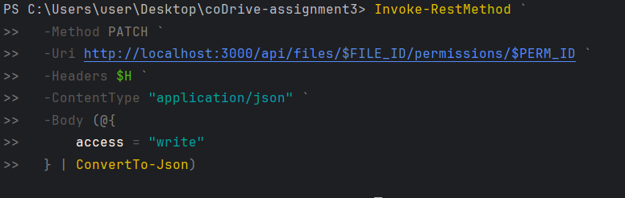

**File Permission**

The previously granted permission is revoked by sending a DELETE request to the permissions endpoint, immediately removing the target user’s access to the file.
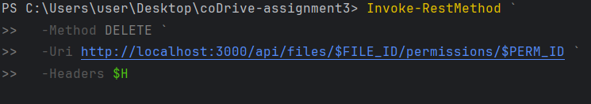

**Delete Folder Recursively**

The root folder is deleted using a DELETE request, triggering a recursive removal that deletes the folder and all of its contained files and subfolders from the user’s file system.
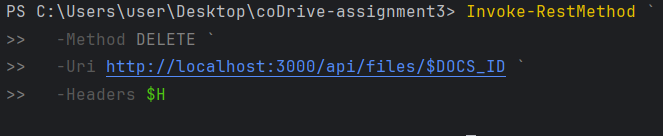

**Verify Empty Search and File System**

Final verification requests confirm that no files remain searchable and that the user’s root directory is empty after the recursive deletion, demonstrating successful cleanup of the file system.
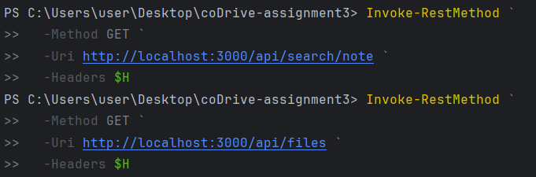

