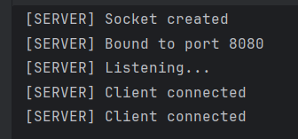
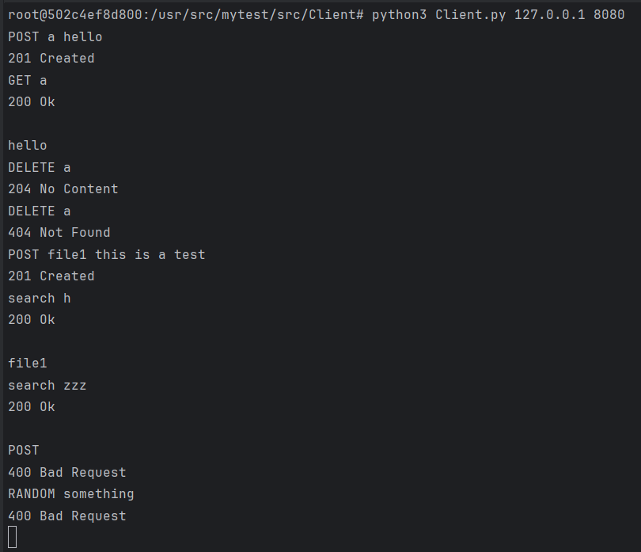
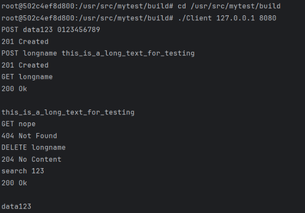

# coDrive Project

### **TCP Server, Multi-Client Support, Command Execution & System Architecture**


This assignment extends the functionality implemented in Assignment 1 by transforming the local command-execution engine into a fully operational TCP server capable of handling multiple clients simultaneously.
The server accepts commands from remote clients (C++ or Python), processes them using the internal logic of Assignment 1, and returns responses in the exact format required.

#### **The main goals of Assignment 2 were:**

● Implementing a multithreaded TCP server

● Supporting multiple concurrent clients

● Integrating the command system from Assignment 1

● Preserving the exact I/O format for all commands

● Ensuring correctness, synchronization, and clean architecture

● Providing clients (C++ & Python) that can connect and send valid commands

---
## Project Structure:
```
coDrive/
│
├── src/
│   ├── server/
│   │   ├── server.cpp             # Entry point: starts TCP server on given port
│   │   ├── ClientHandler.cpp      # Per-client thread logic (read - process - respond)
│   │   └── ClientHandler.h
│   │
│   ├── commands/                  # All command implementations (OCP-compliant)
│   │   ├── AddArticleCommand.cpp
│   │   ├── GetArticleCommand.cpp
│   │   ├── DeleteArticleCommand.cpp
│   │   ├── SearchArticleCommand.cpp
│   │   └── InvalidCommand.cpp
│   │
│   ├── Client/                    # Both C++ and Python clients for remote access
│   │   ├── Client.cpp             # C++ client TCP logic
│   │   ├── Client.h
│   │   ├── mainClient.cpp         # C++ client entry point
│   │   └── Client.py              # Python client implementation
│   │
│   ├── Application.cpp            # High-level for command execution
│   ├── Application.h
│   ├── CommandParser.cpp          # Converts raw input to ICommand objects
│   ├── CommandParser.h
│   ├── FileManager.cpp            # File storage, retrieval, and RLE handling
│   ├── FileManager.h
│   ├── RLECompressor.cpp          # Implements basic RLE compression
│   ├── RLEDecompressor.cpp        # Implements basic RLE decompression
│   └── main.cpp                   # (Optional) Local CLI tester from Assignment 1
│
├── tests/                         # Unit tests from Assignment 1 (GTest)
│   ├── CLIParserTest.cpp          # Tests of CommandParser logic
│   ├── RLETest.cpp                # Tests for RLE compression/decompression
│   └── ApplicationTest.cpp        # Tests for Application (command execution)
│
├── Dockerfile                     # Builds & runs server inside container
├── CMakeLists.txt                 # Build configuration for server, clients, and tests
└── README.md                      # Documentation (this file)
```
---
### Design Reflection – Guided Questions Summary

During the transition from Assignment 1 to Assignment 2, our system required several structural changes, but these changes aligned with the principles of being open for extension yet closed for modification (OCP).
First, splitting the single command-handling file from Assignment 1 into dedicated command classes in Assignment 2 did require us to touch existing files, but this was an intentional refactor meant to increase modularity rather than a violation of OCP.

When introducing new commands such as DELETE and search, we did not need to modify deep logic inside the system; the only adjustments involved normalizing the command keywords (e.g., uppercase/lowercase alignment) and adding parsing logic to extract the search phrase.
Similarly, updating the command input format did not require internal behavioral changes - we extended existing classes rather than rewriting them.

The shift from console-based I/O to TCP socket communication also did not force modifications to business logic.
Only the new networking components (server + clients) were added or updated accordingly, meaning the core application logic remained unchanged and reusable.

Overall, the design choices allowed us to expand the system while preserving previously stable logic.
All relevant explanations, system structure, and architectural decisions are documented in the updated README, ensuring clarity for future reviewers and maintainers.

---
# How to Build & Run (Docker):
**Step 1: Run the Server Using Docker**

Build the Docker Image
```
docker build -t compressor-app .
```
Run tests(optional)
```
docker run --rm -it --entrypoint=/bin/bash compressor-app -c "./runTests"
```
Stop the existing container
```
docker stop codrive-server
```
Remove the container
```
docker rm codrive-server
```
Run the Server Container
```
docker run -p 8080:8080 --name codrive-server compressor-app
```
**step 2: Run the C++ Client (new terminal)**

Enter the running container:
```
docker exec -it codrive-server bash
```
Navigate to the build directory:
```
cd /usr/src/mytest/build
```
Run the C++ client:
```
./Client 127.0.0.1 8080
```

**step 3: Run the Python Client (new terminal)**

Enter the running container:
```
docker exec -it codrive-server bash
```
Navigate to the Python client directory:
```
cd /usr/src/mytest/src/Client
```
Run the Python client:
```
python3 Client.py 127.0.0.1 8080
```
### NOTES: 
● The server is multi-threaded and supports multiple C++ and Python clients simultaneously.

● Both clients communicate with the server using TCP port 8080.

● You may run multiple clients in parallel in separate terminal tabs.

● Once connected, each client should see that the server accepts the connection and can immediately begin sending commands.

---

## Example Run:

### Server - Startup & Client Connections
The server starts successfully, binds to port **8080**, enters listening mode,  
and displays a log message each time a new client (C++ or Python) connects.




### Python Client - Example Commands
The Python client connects to the server and demonstrates valid and invalid commands,  
including POST, GET, DELETE, and search operations.




### C++ Client - Example Commands
The C++ client also connects successfully and performs multiple requests to verify  
the server’s functionality and consistency with the Python client.




