← [Back to Wiki Home](./README.md)

# Mobile Client – CoDrive

---
## Overview

The CoDrive Mobile Client is a React Native application built with Expo, providing a full mobile experience for the CoDrive system.
The application allows users to authenticate, manage files and folders, upload content, share files with permissions, and interact with their drive in a way similar to Google Drive.

--- 

## Running the Mobile Client:

### Authentication

**Login Screen**

Users can log in using their username and password.

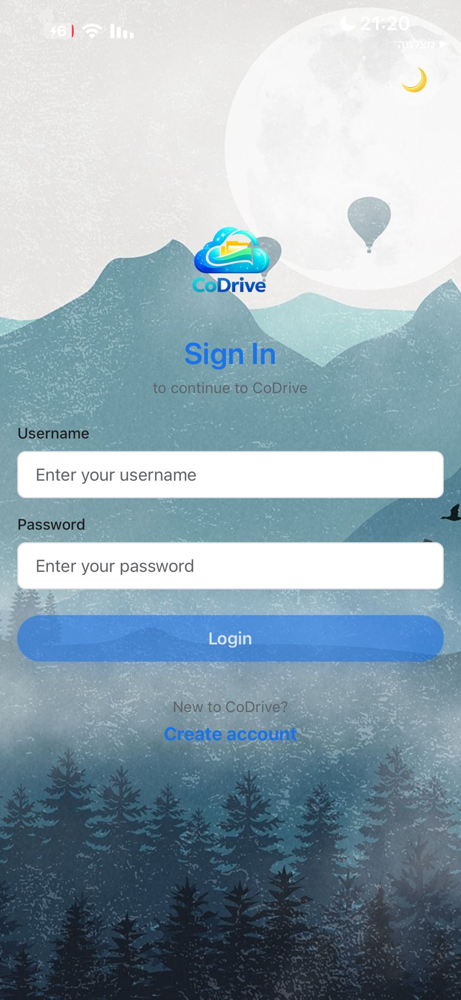

**Create Account**

New users can create an account, including optional profile image selection using the device camera or gallery.

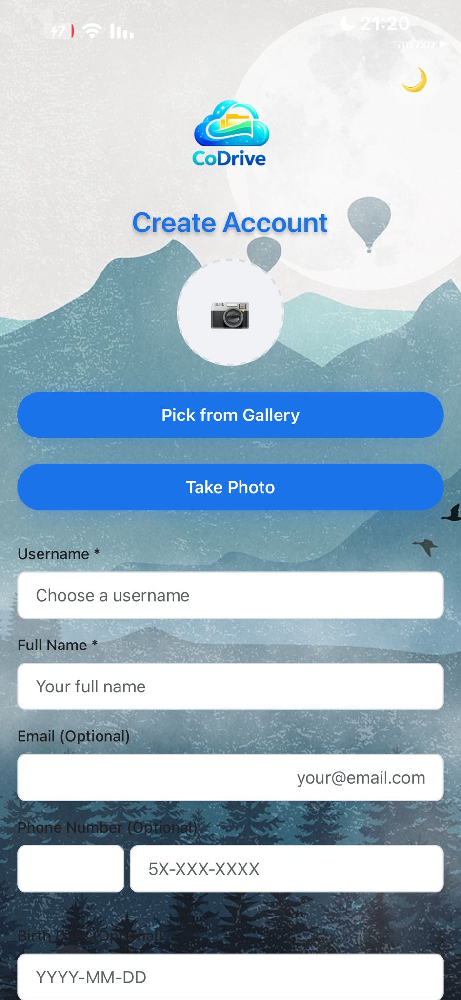

**Main Drive Screen**

The Home screen displays the user’s personal drive and includes:

- Search bar

- Light/Dark mode toggle

- Grid/List view toggle

- Bottom navigation bar

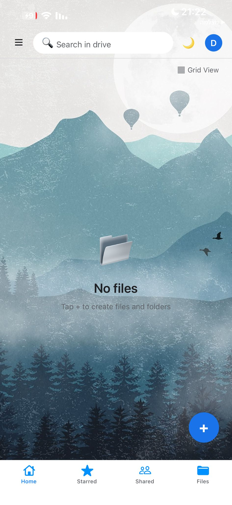

**Creating and Uploading Content**

Using the floating action button (+), users can:

- Upload a generic file

- Upload an image

- Create a text file

- Create a folder

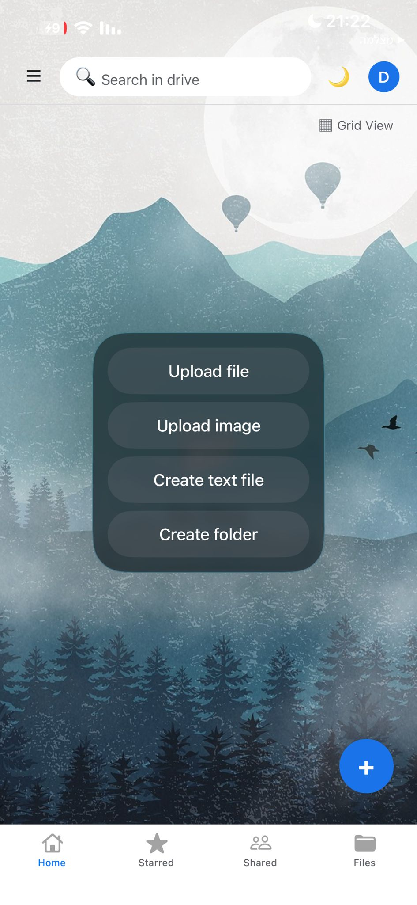
 
**Files and Folders View**

The drive supports multiple file types, including:

- PDF files

- Image files

- Text files

- Folders

Each item is displayed with its name and creation date.

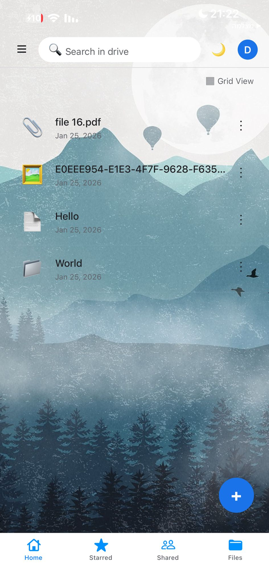

**Search Functionality**

Users can search files by name and by content directly from the drive screen.
Search results update dynamically as the user types.

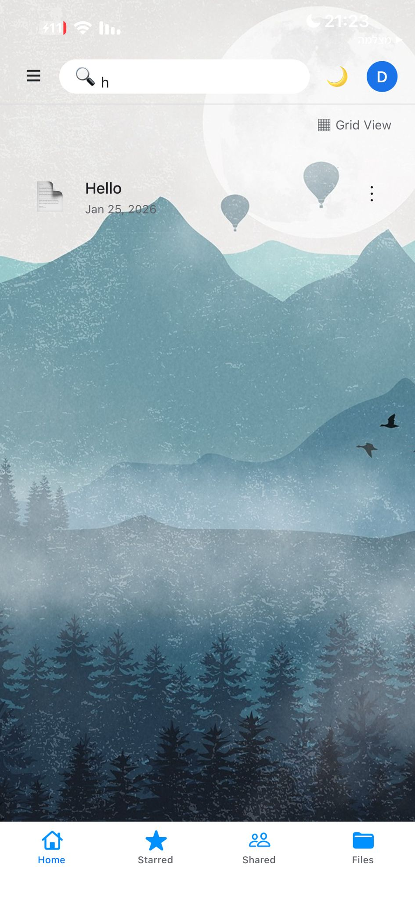

**File Actions (Context Menu)**

Each file includes a context menu with the following actions:

- Add to starred

- Download

- Share

- Rename

- Move to folder

- Move to trash

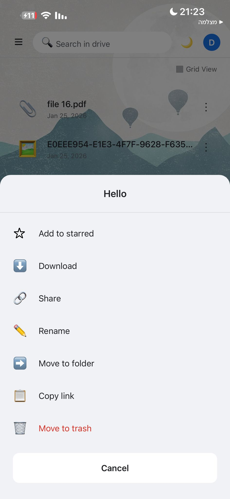

**Text File Viewer and Editor**

Text files can be opened inside the app, edited, and saved back to the server.

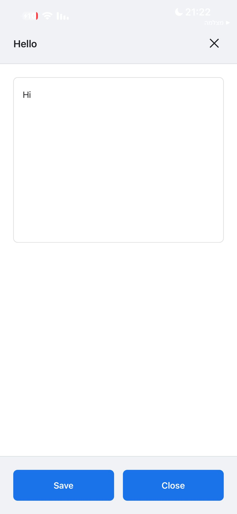

**Deleting Files**

Move to Trash

Deleting a file first moves it to the Trash.

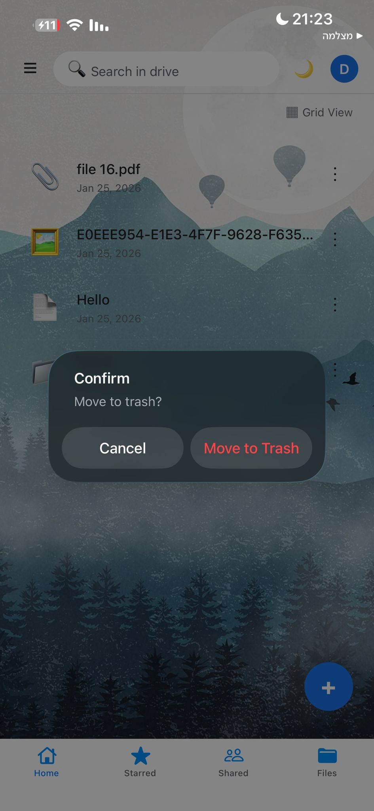

**Trash Management**

From the Trash screen, users can:

Restore files

Permanently delete files

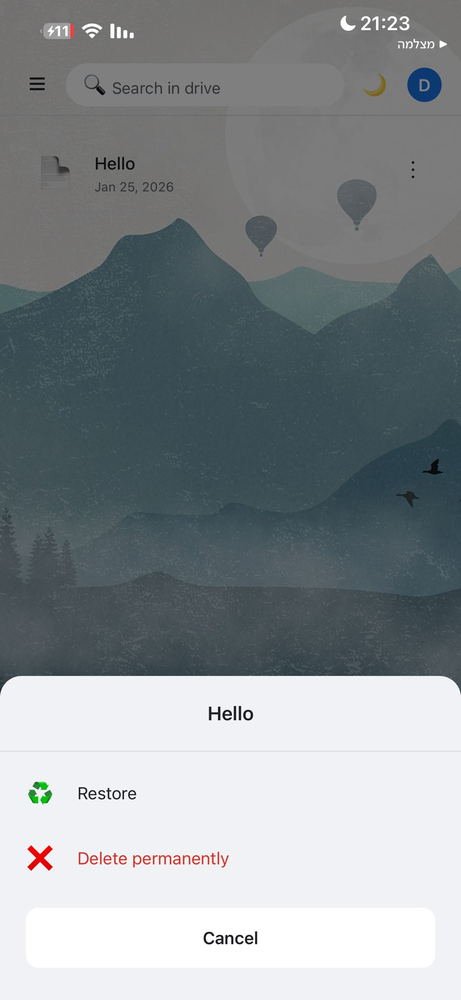

**File Sharing**

Files can be shared with other users by entering their username.
Sharing permissions include:

View – read-only access

Edit – full editing access

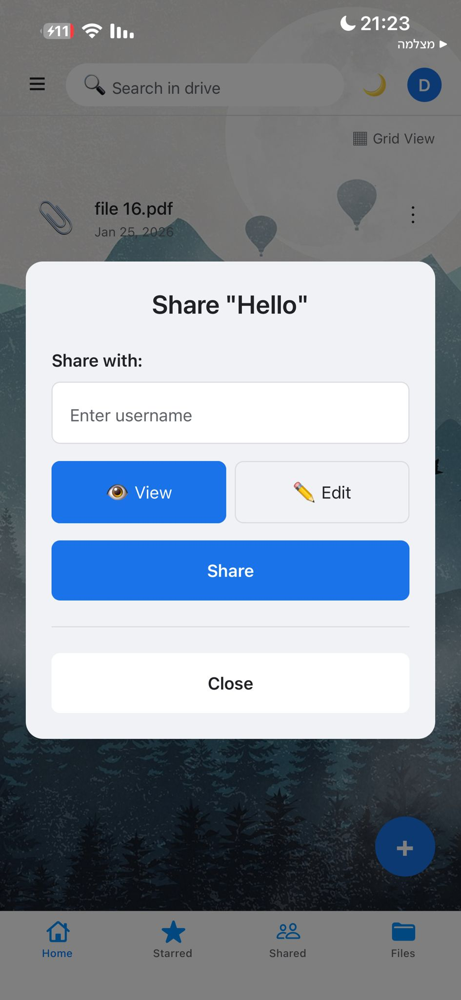

**User Profile**

The profile screen displays basic user information, including:

- Profile image

- Username

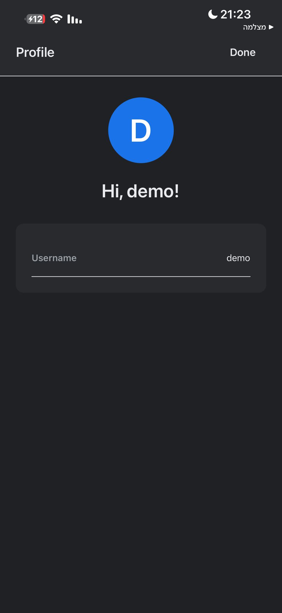

**Navigation**

Side Menu

The side navigation menu allows quick access to:

- Recent files

- Trash

- Logout

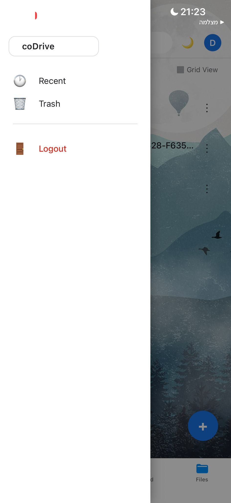

**Bottom Navigation**

The bottom navigation bar provides access to:

- Home

- Starred

- Shared

- Files

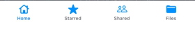

**Theme Support**

The application fully supports Light Mode and Dark Mode, ensuring a consistent user experience across themes.

**Summary**

The CoDrive Mobile Client provides a complete mobile solution for managing files in the CoDrive system.
It integrates authentication, file management, sharing, and modern UI features while maintaining compatibility with the existing backend and web client.

Further details on running the system and demonstrating the implemented features
are provided in the following Wiki sections.
← [Back to Wiki Home](./README.md)