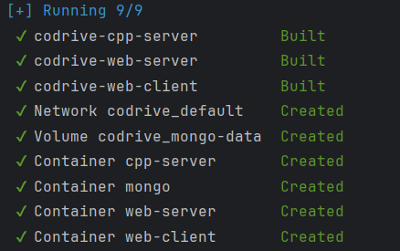
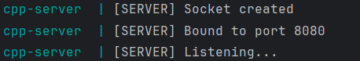
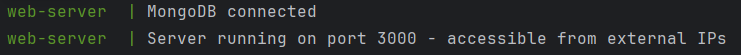
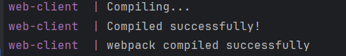
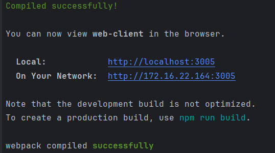
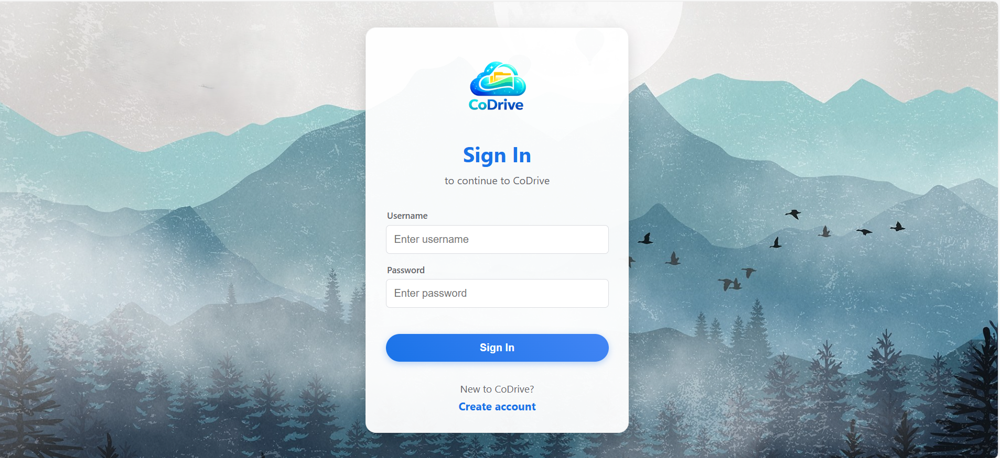
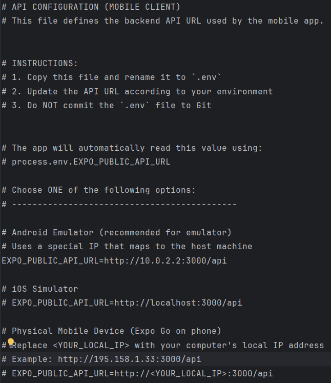
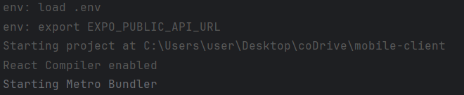
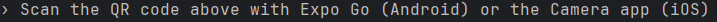

← [Back to Wiki Home](./README.md)

# Running the Full System

This section demonstrates how to build and run the complete coDrive system
using **Docker Compose**.

All backend services and the web client are started together and connected
via a shared Docker network.

---

## Services Overview

The docker-compose configuration starts the following services:

- **MongoDB**  
  Persistent database used to store users, file system nodes, permissions,
  and metadata.

- **Node.js Web Server**  
  RESTful API server responsible for authentication, business logic,
  and communication with MongoDB and the C++ server.

- **C++ Server**  
  Multi-threaded server responsible for low-level file system operations.
  The server listens on port **8080** and handles incoming requests.

- **Web Client (React)**  
  Browser-based client that consumes the REST API and provides a Drive-like UI.

---

## Step 1 – Build and Run the System

From the project root directory, run:

```
docker-compose up --build
```
This command builds all Docker images and starts all system services.

## Step 2 – Verify Running Containers

After the system starts successfully, Docker creates the following components:

Network: `codrive_default`

Volume: `codrive_mongo-data`

Containers:

- `mongo`

- `web-server`

- `cpp-server`

- `web-client`

The containers are attached and running without errors.

The following screenshot shows Docker Compose successfully creating the network,
volume, and all required containers for the system.



## Step 3 – Service Initialization

During startup:

- The C++ server successfully creates a socket, binds to port 8080, and begins listening for connections.

The following screenshot shows the C++ server initializing successfully,
binding to port 8080, and starting to listen for incoming connections.




- MongoDB starts successfully and accepts connections.

The following screenshot shows the Node.js server successfully connecting
to MongoDB and starting the REST API on port 3000.



- The Node.js server connects to MongoDB using Mongoose and initializes the required collections and indexes.

- The Web Client starts a development server and becomes accessible via the browser.

The following screenshot shows the web client compiling successfully
and becoming available through the browser.




## Step 4 – Web Client Execution

From the `web-client/` directory, run:

```
npm start
```
This command starts the React development server for the web client.
Once the server is running, the application is accessible via a web browser
and communicates with the Node.js REST API.

The following screenshot shows the web client compiling successfully
and becoming accessible through the browser.



The following screenshot shows the web client entry (login) screen.

The web client supports the same core functionality as the mobile client.
However, since this assignment focuses on the mobile client implementation,
the main functional flows are demonstrated using the mobile application.

This screenshot is included to provide general context and familiarity
for anyone reviewing or running the project.



## Step 5 – Mobile Client Execution

Mobile client API configuration
The mobile application reads the backend API URL from an environment variable.
The .env file allows switching easily between Android emulator, iOS simulator, and a physical mobile device.
just change the value of The `.env.example` file by updating the `EXPO_PUBLIC_API_URL` value in the `mobile-client/` directory.



From the `mobile-client/` directory, run:\

```
npx expo start -c
```
This command starts the Expo development server for the mobile application.
The app can be launched on a physical device using Expo Go or on an emulator,
and connects to the same Node.js REST API as the web client.

Expo loading environment variables
This confirms that the mobile client successfully loads the .env file and exports EXPO_PUBLIC_API_URL before starting the Metro Bundler.



> **Note:**  
> To run the app on an Android emulator, Android Studio must be installed.  
> Open **Android Studio → Device Manager**, create and start a virtual device (AVD), and then launch **Expo Go** inside the emulator.
>
> To run the app on a physical mobile device, install the **Expo Go** app from the App Store / Google Play and scan the generated QR code using the device’s camera.


Starting the Expo development server
The Expo CLI starts the Metro Bundler and generates a QR code that can be scanned using the Expo Go app on a physical mobile device.




Running the app on a physical device
The application is executed on a real mobile phone using Expo Go by scanning the generated QR code.
This is the primary execution method used for demonstrating the mobile client functionality.

Mobile client – authentication screen

This is the initial screen of the mobile application, allowing users to sign in or create a new account.
All core system features demonstrated in this project are accessed through the mobile client.


Further details on running the system and demonstrating the implemented features
are provided in the following Wiki sections.

← [Back to Wiki Home](./README.md)
